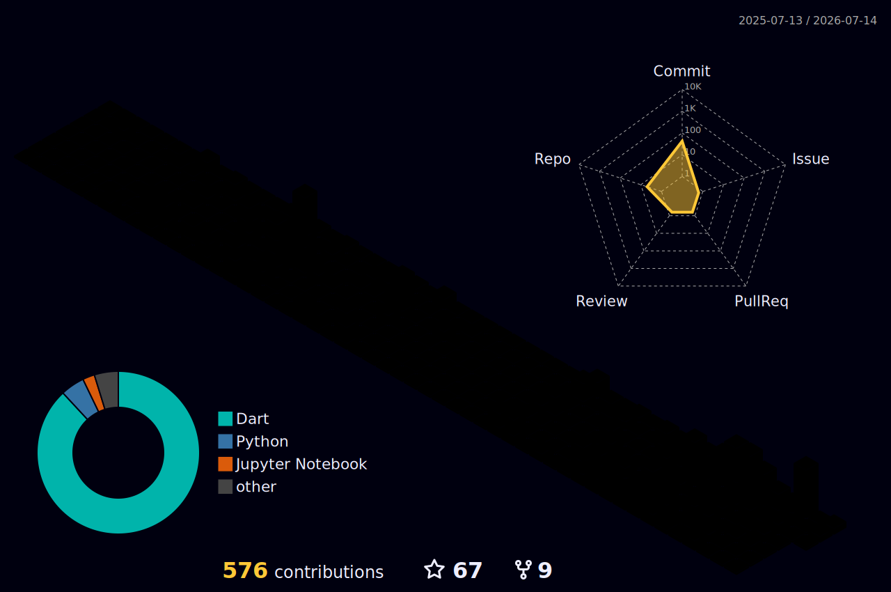

  

  

<h3 align="center">⚡ Software Engineer, Builder · Shipping across mobile, web, desktop, backend & AI — from Nepal 🇳🇵</h3>

  
  

---

### 🚀 About Me

- 🛠️ Software engineer & builder who loves **shipping** — ideas into real products
- 🌍 I build across the stack: **mobile, web, desktop, backend & AI**
- 🔭 Currently crafting **Flutter** apps and **backend systems**, end to end
- 🚀 Entrepreneur at heart — I like owning a product from idea to launch
- 🤝 Open to collaborating on **products** & **open-source** projects
- 💬 Ask me about **Flutter**, **Dart**, backend & building from scratch
- 🌐 Portfolio: [subashkc.info.np](https://www.subash-kc.com.np/)
- ⚡ Fun fact: _Code never lies, comments sometimes do._

  

---

### 🔗 Connect with me

  
  
  
  

---

### 🛠️ Tech Stack

**Languages**

**Frameworks & Tools**

**Databases & Cloud**

---

### ⏱️ Weekly Coding Stats

<!--START_SECTION:waka-->

_Coding activity will appear here once WakaTime is connected._

<!--END_SECTION:waka-->

---

### 📊 GitHub Stats

  
  

  

  

  

  
  

  

---

### 🧊 Contribution 3D

  

---

### 📈 Metrics

  

---

### 🐍 Watch my contributions get eaten

  

---

  

<i>⭐️ From <a href="https://github.com/subash9860">subash9860</a></i>

